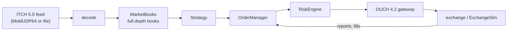
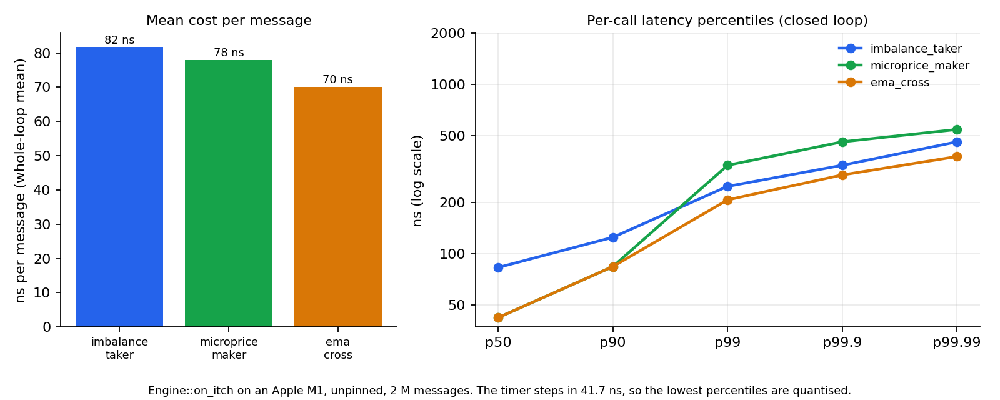
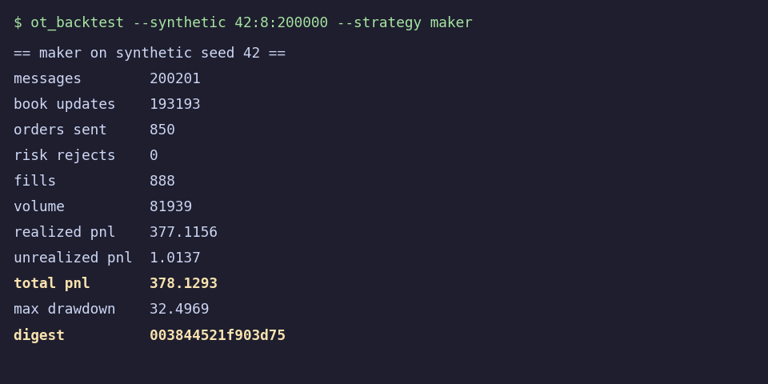
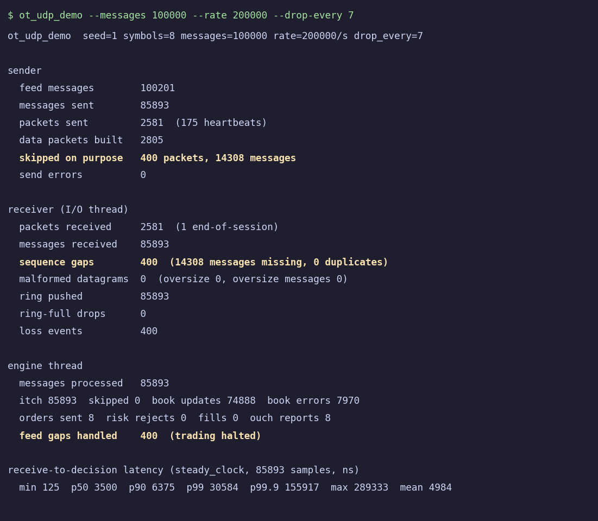
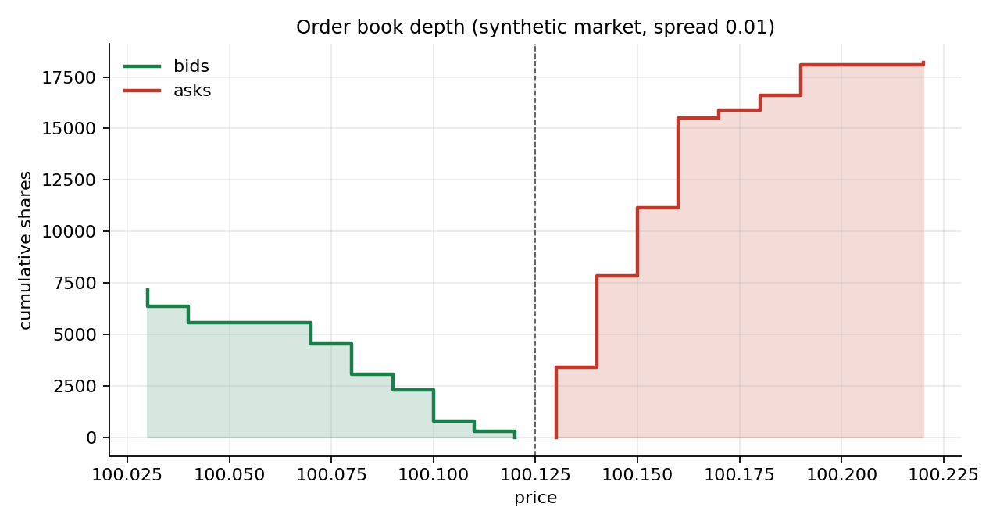

# OptiTrade

[](https://github.com/Harsh-ryUk/OptiTrade-Engine/actions/workflows/ci.yml)


A deterministic, allocation-free **trading client** in modern C++20. It consumes the real Nasdaq market data
protocol (ITCH 5.0 over MoldUDP64), maintains full-depth order books, runs strategies against them, applies
pre-trade risk limits and speaks the real order entry protocol (OUCH 4.2). A built-in exchange simulator,
capture/replay and a backtester let you test everything without a market connection.

* **Real protocols.** ITCH 5.0, OUCH 4.2 and MoldUDP64 implemented against the published specifications
  ([conformance notes](docs/PROTOCOLS.md)).
* **Allocation-free hot path.** All tables are sized at construction; a test using a replaced `operator new`
  proves message processing allocates nothing ([design](docs/DESIGN.md)).
* **Deterministic.** Integer arithmetic only. A full backtest produces the same digest on macOS (Apple clang),
  Linux gcc and Linux clang, and the repository tests that.
* **Heavily verified.** About 37 test programs, differential and model-based tests, fuzzing, sanitizers
  ([testing](docs/TESTING.md)).
* **Header-only, no dependencies** beyond the C++ standard library and POSIX sockets.

## Quick start

```bash
cmake --preset release
cmake --build --preset release
ctest --preset release

# generate a synthetic market and backtest a strategy on it
./build/release/ot_backtest --synthetic 42:8:200000 --strategy maker

# latency benchmark
./build/release/ot_bench --strategy all --messages 2000000

# live-style pipeline over loopback UDP (MoldUDP64 -> SPSC ring -> engine thread)
./build/release/ot_udp_demo --messages 100000 --rate 200000
```

| Tool | Purpose |
|---|---|
| `ot_gen` | write a deterministic synthetic ITCH capture |
| `ot_backtest` | replay a capture, a Nasdaq BinaryFILE or a synthetic market through the engine and simulator; PnL report and digest |
| `ot_bench` | tick-to-decision latency, with coordinated-omission-aware open-loop mode |
| `ot_udp_demo` | three-thread MoldUDP64 pipeline with loss injection and gap handling |
| `ot_itch_inspect` | statistics and book state for a Nasdaq ITCH file |
| `ot_replay_bench` | feed replay throughput (decode + order books) on a Nasdaq BinaryFILE |
| `scripts/linux_benchmark.sh` | pinned, multi-run latency benchmark for a Linux machine; writes a results folder |
| `ot_book_dump` | print an order-book ladder as CSV (`tools/plot_book.py` draws it) |

Presets: `dev`, `release`, `asan` (ASan + UBSan), `tsan`, `fuzz` (libFuzzer, clang).

## Architecture



Modules: `core` (fixed-capacity containers, SPSC ring, deterministic RNG), `itch`/`ouch`/`net` (wire formats,
MoldUDP64, UDP), `book`, `strategy` (a C++20 concept with three implementations), `risk`, `oms`, `engine`,
`sim` (exchange simulator, synthetic market), `replay` (capture files, backtester). See
[docs/DESIGN.md](docs/DESIGN.md).

## Results

All numbers below come from runs of the code in this repository.

**Latency** (Apple M1, Release, unpinned desktop, 2 M messages, 8 symbols, closed loop;
[method and caveats](docs/BENCHMARKING.md)):

| Strategy | Mean cost per message | Throughput |
|---|---:|---:|
| Imbalance taker | 81.6 ns | 12.3 M msg/s |
| Microprice maker | 78.0 ns | 12.8 M msg/s |
| EMA crossover | 70.1 ns | 14.3 M msg/s |

This is the engine's own processing time for one message, not wire-to-wire latency, and it has not been
measured on x86 or an isolated core.

**Feed replay on the real Nasdaq file** (30 December 2019, 268.7 M messages, memory-mapped, single thread, decode plus
order books): 5.2 M messages/s over the whole day including disk reads, and 6.4 to 6.8 M messages/s when the file is in
memory ([details](docs/BENCHMARKING.md#feed-replay-throughput-ot_replay_bench)). A profile-guided pass raised these from
3.7 and 4.6 M messages/s.



**Backtests** on the synthetic market (seed 42, 8 symbols, 200 000 messages, 50 µs latency each way). They
show that the tooling works end to end; the market is synthetic and these are not claims about real
profitability:

| Strategy | Orders | Fills | Volume | Total PnL | Digest |
|---|---:|---:|---:|---:|---|
| Imbalance taker | 2 736 | 2 648 | 251 662 | -957.98 | `71b2bc32e2aaea05` |
| Microprice maker | 850 | 888 | 81 939 | 378.13 | `003844521f903d75` |
| EMA crossover | 2 897 | 2 832 | 276 919 | -2 654.86 | `8ae3940c57b17a0d` |

## See it run

A backtest, replaying 200 000 synthetic market messages through the engine and simulator. The digest is a
fingerprint of every order and every exchange reply and is identical on every platform:



Streaming the feed over UDP while dropping every 7th packet. The engine counts exactly what was lost,
cancels its orders and halts trading rather than trade on a broken book (the book errors are the direct
consequence of the missing messages):



The order book the engine maintains for one instrument (synthetic market):



## Real Nasdaq data

The tools were run on Nasdaq's public sample file for 30 December 2019 (`12302019.NASDAQ_ITCH50.gz`,
8.25 GB uncompressed, **268 744 780 messages, 8 906 instruments**). Raw output is in
[`results/real_data_nasdaq_2019-12-30.txt`](results/real_data_nasdaq_2019-12-30.txt).

* **Decoder and order books:** zero decode errors, zero unknown orders, zero duplicates, zero invalid updates,
  and **zero live orders at the end of the day**: every order the feed added was later cancelled, deleted or
  executed, so the book accounting agrees with Nasdaq's for the whole session.
* **Full pipeline** (decode, books, strategy, risk, order manager, exchange simulator) over the whole day takes
  3.5 to 4.2 minutes per strategy on an M1 laptop and about 3 GB of memory.
* Running on real data found and fixed three problems that the synthetic market could not show: quotes at
  placeholder prices were used as a reference price, the backtester re-marked positions against such
  quotes at the end of the run, and the backtester ran without a price band, so strategies traded at those quotes.
* 58 314 of the 268.7 M messages (0.02 %) exceeded the configured limit of 1 024 price levels per side and were
  refused by the books; the backtester warns about this.

| Strategy (real data, full day) | Orders | Shares traded | Total PnL |
|---|---:|---:|---:|
| Imbalance taker | 6.96 M | 444 M | -$5.6 M |
| Microprice maker | 1.68 M | 36 M | -$1.2 M |
| EMA crossover | 8.36 M | 539 M | -$93.1 M |

The strategies are simple and untuned, and the simulator is an approximation, so these losses (mostly the cost of
crossing the spread) are not a statement about any real strategy. They show that the whole stack handles a full
real trading day.

To reproduce (the file is not redistributed here):

```bash
curl -O "https://emi.nasdaq.com/ITCH/Nasdaq%20ITCH/12302019.NASDAQ_ITCH50.gz"   # 3.5 GB
gunzip 12302019.NASDAQ_ITCH50.gz
./build/release/ot_itch_inspect --max-orders 8388608 --levels 1024 12302019.NASDAQ_ITCH50
./build/release/ot_backtest --itch 12302019.NASDAQ_ITCH50 --strategy imbalance \
    --book-orders 8388608 --book-levels 1024 --session-orders 4194304
```

## Verification

Every change is checked by CI on Linux (gcc and clang), macOS, with AddressSanitizer + UBSan, with
ThreadSanitizer, with a short libFuzzer run on each decoder, and by comparing gcc and clang backtest digests.
Independent review passes found and fixed real defects in the order manager and the exchange simulator; each
has a regression test. Details and the list of what is **not** covered are in
[docs/TESTING.md](docs/TESTING.md).

## Limitations

* The exchange simulator is an approximation (displayed liquidity, no market impact, conservative queue
  position), and the strategies are untuned: backtest PnL says nothing about real profitability. Real data has
  been run for one trading day (30 December 2019) only.
* No retransmission requests, no SoupBinTCP or TCP order entry, no kernel-bypass networking.
* GCC and Clang only (`__int128` is used for overflow-free accounting).

## Layout

```
include/optitrade/   the engine (header-only)
apps/                command line tools and benchmarks (ot_*.cpp)
tools/               plotting scripts for the charts above
tests/               unit, differential, model-based, property and concurrency tests
fuzz/                libFuzzer targets
docs/                design, protocols, testing, benchmarking
results/             benchmark output committed as evidence
```

## License

MIT. See [LICENSE](LICENSE).
