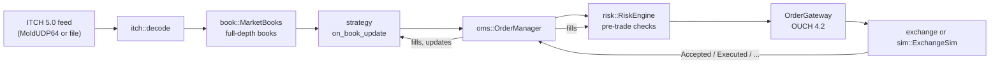

# Design

OptiTrade is the client side of an electronic market: it listens to a market data feed, keeps a full
picture of the order books, lets a strategy decide, checks the decision against risk limits and sends the
order. Everything is header-only C++20 under `include/optitrade/`.

## Principles

1. **No allocation on the message path.** Every table (order table, price levels, order slots, report
   queues, rings) is sized when the object is constructed. `test_engine` proves with a replaced
   `operator new` that processing messages, orders, reports and a feed gap allocates nothing. One honest
   exception: a book for an instrument is created the first time the engine sees it. Real ITCH feeds announce every
   instrument with a Stock Directory message at the start of the day, so in practice this happens before trading
   starts; the engine does not preallocate 65 536 books because that would cost hundreds of megabytes.
2. **Deterministic.** Decision code uses integers only (no `float`/`double`, no `<random>`, no hash iteration
   order, no clock). The same input gives the same orders, fills and PnL on every compiler and OS, which is
   what makes golden-digest regression tests possible.
3. **Hostile input is expected.** Decoders are bounds-checked and return a status; they never read past the
   buffer. Books, order manager and simulator tolerate unknown references, duplicates, over-executions and
   reordered reports without corrupting their state.
4. **Real protocols, not invented ones.** See [PROTOCOLS.md](PROTOCOLS.md).

## Modules

| Module | Responsibility | Notes |
|---|---|---|
| `core/` | Fixed-capacity building blocks | `FlatHashMap` (open addressing, backward-shift delete), `SlabPool` (32-bit handles), `SpscRing` (wait-free), xoshiro `Rng`, FNV `Digest`, byte-order helpers |
| `itch/`, `ouch/`, `net/` | Wire formats and transport | Zero-copy decoders with handler callbacks, encoders for tests and the simulator, MoldUDP64 packets and gap tracking, POSIX UDP sockets |
| `book/` | Order books from ITCH | One `OrderBook` per instrument: each side is a sorted array of price levels with the best price at the end, so updates near the touch move almost nothing. `MarketBooks` owns the order table, symbol directory and applies every ITCH message |
| `strategy/` | Trading logic | A C++20 concept (`Strategy`): `on_book_update`, `on_fill`, `on_order_update`. Three implementations: depth-imbalance taker, microprice market maker with inventory skew, EMA crossover |
| `risk/` | Pre-trade checks and accounting | Kill switch, size, notional, per-instrument and gross position (worst case including open orders), price band against the mid, sliding-window order rate, open-order count, loss limit. Position, average cost and realised/unrealised PnL are updated from fills |
| `oms/` | Order lifecycle | State machine (pending, live, pending cancel/replace, filled, canceled, rejected), exposure bookkeeping, duplicate and out-of-order report handling, slot reuse for finished orders |
| `engine/` | Glue | `Engine<Strategy>` decodes, updates books, calls the strategy and routes exchange reports back. Halts on a feed gap |
| `sim/` | Exchange simulator and synthetic market | See below |
| `replay/` | Capture files and backtester | `run_backtest` drives engine and simulator over any record source and reports PnL plus a digest |

## The strategy interface

Strategies receive a `Context` with the clock, the books, an `OrderApi` (submit, cancel, replace) and a
read-only view of risk. Strategy code never touches the gateway. Orders submitted from inside a callback
are risk-checked and sent synchronously; the order manager notifies listeners before `submit` returns, which
all shipped strategies handle.

## Risk model

Limits are per instrument and global. The position check uses the *worst case*: current position plus
every open order on the same side plus the new order. Orders that only reduce an over-limit position are
allowed. A replace is checked as a new order for the new total quantity and price, plus the incremental
position exposure. A rejected order consumes no rate-limit budget. The loss limit trips the kill switch
automatically.

## Exchange simulator

`ExchangeSim` stands in for the exchange so strategies can be backtested on real or synthetic feeds. It
accepts the same OUCH messages as a real gateway and emits the same reports.

* Orders reach the exchange after a configurable latency and reports return after another one.
* Marketable orders walk the displayed book at each level's price; there is no market impact.
* A resting order joins the back of the displayed queue at its price; only later executions at that price
  advance it, and cancels by other participants do not (conservative). Our own orders at one price stay in
  FIFO order.
* A replace loses priority. A fill never happens outside an order's limit.

These are approximations of a real matching engine, and results from them should be read that way.

## Feed gaps

Detecting a gap is the transport's job (`SequenceTracker`); `Engine::on_feed_gap` then cancels every open
order (retrying refused cancels), refuses new orders and stops calling the strategy. Rebuilding the books
and resuming (`resume_trading`) is left to the caller, because that needs a snapshot or replay source.

## The UDP demo

`ot_udp_demo` shows the intended live threading model: a sender thread paces a synthetic feed into
MoldUDP64 packets over loopback; an I/O thread receives, checks sequence numbers and pushes messages into an
`SpscRing` (it never blocks: a full ring counts a drop and signals a loss); an engine thread pops and
processes them.

## Known limitations

* The fill model is an approximation (above) and the strategies are untuned; nothing here predicts real
  profitability. Only one real trading day has been replayed.
* Hash-table order references are trusted: an adversary who controls order reference numbers could force
  collisions. A real exchange assigns them.
* No retransmission requests, no SoupBinTCP session layer, no TCP order entry.
* `__int128` is used for overflow-free accounting, so MSVC is not supported (GCC and Clang are).
